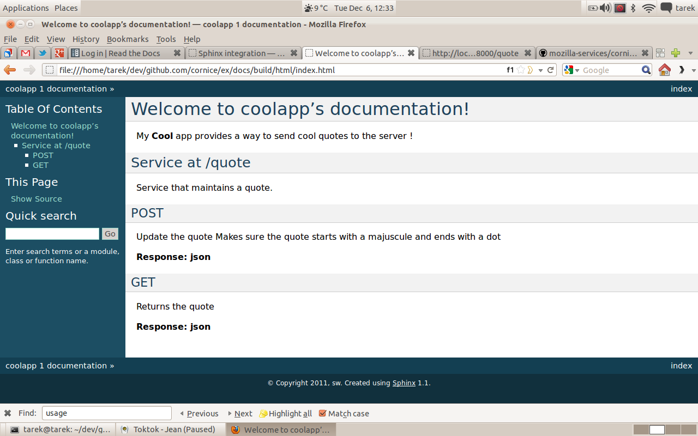

Sphinx integration
==================

Maintaining documentation while the code is evolving is painful.
Avoiding information duplication is also quite a challenge.

Cornice tries to reduce a bit the pain by providing a Sphinx
(http://sphinx.pocoo.org/) directive that scans the web
services and build the documentation using:

- the description provided when a Service instance is created
- the docstrings of all functions involved in creating the response:
  the web services function itself and the validators.

The assumption made is that maintaining those docstrings while
working on the code is easier.

Activate the extension
----------------------

To activate Cornice's directive, you must include it in your
Sphinx project :file:`conf.py` file::

    import cornice

    sys.path.insert(0, os.path.abspath(cornice.__file__))
    extensions = ['cornice.ext.sphinxext']

Of course this may vary if you have other extensions.

The service directive
---------------------

Cornice provides a **cornice-autodoc** directive you can use to
inject the Web Services documentation into Sphinx.

The directive has the following options:

- **modules**: a comma-separated list of the python modules that contain
  Cornice Web services. Cornice will scan it and look for the services.
- **app**: set the path to you app needed for imperative registering services.
- **services**: a comma-separated list of services, as you named them when
  using the cornice `Service` directive. **optional**
- **service**: if you have only one name, then you can use `service` rather
  than `services`. **optional**
- **ignore**: a comma separated list of services names to ignore. **optional**

  **module** or **app** are **mandatory**

You can use info fields (see
`Info field lists <http://sphinx.pocoo.org/domains.html#info-field-lists>`_)
in your functions, methods and validators.

.. note::
    This directive used to be named "services" and had been renamed for
    something more consistant with the Sphinx ecosystem.

Full example
------------

Let's say you have a **quote** project with a single service where you
can **POST** and **GET** a quote.

The service makes sure the quote starts with a majuscule and ends with
a dot !

Here's the **full** declarative app::

    from cornice import Service
    from pyramid.config import Configurator
    import string

    desc = """\
    Service that maintains a quote.
    """

    quote = Service(name='quote', path='/quote', description=desc)

    def check_quote(request):
        """Makes sure the quote starts with a majuscule and ends with a dot"""
        quote = request.body
        if quote[0] not in string.ascii_uppercase:
            request.errors.add('body', 'quote', 'Does not start with a majuscule')

        if quote[-1] not in ('.', '?', '!'):
            request.errors.add('body', 'quote', 'Does not end properly')

        if len(request.errors) == 0:
            request.validated['quote'] = quote

    _quote = {}
    _quote['default'] = "Not set, yet !"

    @quote.get()
    def get_quote(request):
        """Returns the quote"""
        return _quote['default']

    @quote.post(validators=check_quote)
    def post_quote(request):
        """Update the quote"""
        _quote['default'] = request.validated['quote']

    def main(global_config, **settings):
        config = Configurator(settings={})
        config.include("cornice")
        config.scan("coolapp")
        return config.make_wsgi_app()

    if __name__ == '__main__':
        from wsgiref.simple_server import make_server
        app = main({})
        httpd = make_server('', 6543, app)
        print("Listening on port 6543....")
        httpd.serve_forever()

And here's the **full** Sphinx doc example::

    Welcome to coolapp's documentation!
    ===================================

    My **Cool** app provides a way to send cool quotes to the server !

    .. cornice-autodoc::
       :modules: coolapp
       :service: quote

Here's the **full** imperative app::

    from cornice import Service
    from pyramid.config import Configurator
    import string

    def check_quote(request):
        """Makes sure the quote starts with a majuscule and ends with a dot"""
        quote = request.body
        if quote[0] not in string.ascii_uppercase:
            request.errors.add('body', 'quote', 'Does not start with a majuscule')

        if quote[-1] not in ('.', '?', '!'):
            request.errors.add('body', 'quote', 'Does not end properly')

        if len(request.errors) == 0:
            request.validated['quote'] = quote

    _quote = {}
    _quote['default'] = "Not set, yet !"

    def get_quote(request):
        """Returns the quote"""
        return _quote['default']

    def post_quote(request):
        """Update the quote"""
        _quote['default'] = request.validated['quote']

    def main(global_config, **settings):
        config = Configurator(settings={})
        config.include("cornice")
        desc = "Service that maintains a quote."
        quote = Service(name='quote', path='/quote', description=desc)
        quote.add_view("GET", get_quote)
        quote.add_view("POST", post_quote, validators=check_quote)
        config.add_cornice_service(quote)
        return config.make_wsgi_app()

    if __name__ == '__main__':
        from wsgiref.simple_server import make_server
        app = main({})
        httpd = make_server('', 6543, app)
        print("Listening on port 6543....")
        httpd.serve_forever()

Client calls::

    $ curl -X POST http://localhost:6543/quote -d Hansolohat.
    null
    $ curl -X GET http://localhost:6543/quote
    "Hansolohat."

And here's the **full** Sphinx doc example::

    Welcome to coolapp's documentation!
    ===================================

    My **Cool** app provides a way to send cool quotes to the server !

    .. cornice-autodoc::
       :app: coolapp
       :service: quote

The resulting doc is:

